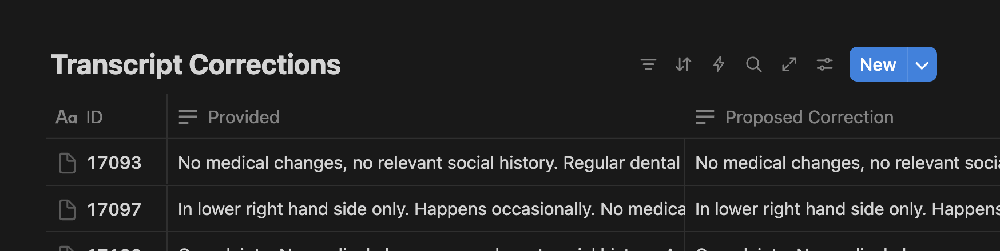

Evaluating LLM pipelines/workflows improvements is key to improving our AI systems. With limited time and resources, oftentimes the blocker is: overthinking them. In this article, I'll talk through a couple simple evals for benchmarking your improvements, based on work I've done previously.


## The Curse of Overthinking

I've learnt that evals really can be as simple as an `assert` statement. The goal here is doing quick "smoke tests" to ensure that your pipeline is working as expected, whilst accounting for stochasticity. From that point, complexity is incrementally earned by structuring your evals around your most common & important failure modes.

If these failure modes aren't immediately apparent to you yet, then hunt for them first.

<!-- more -->


## Scenario: Improving Transcription for a Dental AI Assistant

I was tasked to improve a dental-industry AI assistant, which takes in audio and generates transcripts before generating structured doctor notes. The problem was, the assistant's baseline transcription was often inaccurate, and did not reflect the actual words said. In other words, it failed seemingly randomly, and the solutions were not apparent yet.

First things first, I built a **simple testing suite** that could transcribe the dental consults across different providers, and a **Notion page to capture my findings** from listening to the ground truth dataset.

* The key insight for the testing suite: set it up to handle different STT providers (some are audio-only, others are allow multi-modal inputs like a prompt), prompt configurations and you'll be able to test hypotheses of accurate transcription.

```python
from abc import ABC, abstractmethod

class BaseTranscribe(ABC):
    @abstractmethod
    async def transcribe_async(self, audio_path: str) -> str:
        """Transcribes an audio file asynchronously."""
        raise NotImplementedError("Subclasses must implement this method.")
```

* For handling inaccuracy in transcription, I defaulted to a simple Word Error Rate (WER) measurement. I used `jiwer` to keep it simple but you can start with any library you'd like.

* Next to each conversation was my personal annotation for the dataset to compare against the ground truth, though you can also use it as a space for open-ended notes about failure modes.



After annotating dozens of conversations, clear patterns/failure modes emerged.

* Since the reference dataset was generated across a couple different dentists, annotations differed (i.e. Upper Left Six vs UL6)
* Differences in accent meant tiny spelling errors that could derail a significant chunk of the transcript.
* The reference would have an incorrect word replaced in the transcript by an inline addition rather than replacing the word
* Audio fluctuates in quality throughout the playback

Each recording is then mapped to specific failure mode labels and their frequency is accounted for.

### Look at Your Data
Looking at the actual data allowed us to identify patterns in the data that WER alone could not capture, and let metrics organically emerge from there. Here we've built a taxonomy of common failure modes that we could then devise strategies for.

With that in mind, we performed a couple methods to further clean up the audio, and the effect that these had on our WER:

- **Baseline**
- **Normalisation** (of dental terms [e.g. x-ray, x ray, xray], whitespace, British/US spelling, punctuation) — 1-4% reduction
- **Multimodal Inputs** (using reference transcript + audio + unoptimized prompt) — 5-7% reduction
- **Use Handcrafted Annotations** (from manual playback and own annotation) - 70-80% reduction

These low hanging fruits typically serve as a great foundation for future improvements.

## Evaluating Further Improvements

After our quick wins, it was apparent we're in the right direction. However, the road ahead to improving our transcription accuracy is now branched out. The questions were clear but the answers were not.

1. "Let's fix accuracy. How do we fix spelling mistakes (without overfitting)?"
2. "Let's reduce noise. How do we make sure we preserve speaker characteristics?"

The ability to experiment fast, evaluate quantitatively and compare easily becomes necessary to benchmark the effectiveness of different approaches.

Here, bootstrapping and t-testing arise as viable approaches to showcasing our tiny experiments' effect on the WER.

### Bootstrapping & T-testing

!!! Note
    Bootstrapping is a resampling technique that estimates the sampling distribution of a statistic by repeatedly sampling with replacement from the observed data. T-tests, on the other hand, are used to compare the means of two groups and determine if the difference is statistically significant.

The goal here really is: given our small (but diverse enough) dataset, how can I measure if an approach actually improves our benchmark? And how can I be confident this improvement isn't just random luck?

We'd need to:

1. Create new samples by randomly drawing from our original data (allowing for duplicate data points)
2. Calculate our mean WER for each resampled dataset
3. Compare the distributions of the two datasets to see if WERs are significantly different
4. Calculate confidence intervals to assess the statistical significance of the improvement
5. Optionally perform t-testing to obtain formal p-values, for hypothesis testing

In my scenario, I wanted to know whether a given speech enhancement model could measurably improve our audio quality. I used the [`indomee`](https://github.com/ivanleomk/indomee) library to make the measurements dead simple to implement.

```python
from indomee import bootstrap_from_results
import pandas as pd

df = pd.read_csv("results.csv")

# Get mean WER across 2 different methods
baseline = df[df['is_enhanced'] == False]['wer'].tolist()
enhanced = df[df['is_enhanced'] == True]['wer'].tolist()

baseline_stats = bootstrap_from_results(baseline)
enhanced_stats = bootstrap_from_results(enhanced)

print(baseline_stats)
print(enhanced_stats)

# > BootstrapMetric(name='bootstrap_metric', value=0.13846153846153847, ci_lower=0.10830769230769231, ci_upper=0.18)
# > BootstrapMetric(name='bootstrap_metric', value=0.1346153846153846, ci_lower=0.10876923076923077, ci_upper=0.1630769230769231)
```

Here we can see that the enhanced method does result in a lower mean WER (from `0.1385` to `0.1346`), but it's not statistically significant as the confidence intervals overlap substantially. The improvement could be due to random variation rather than an actual enhancement. To confirm this observation, we head over to t-testing.

```python
from indomee import perform_t_tests

results = perform_t_tests(
  baseline, enhanced,
  names = ['baseline', 'enhanced'],
  paired = True
)

# >   population_1 population_2  t_statistic   p_value  significant
# >     baseline     enhanced         0.27  7.88e-01        False

```

The t-tests confirm what the bootstrap results suggested: the small improvement in WER is indeed not statistically significant. With a p-value of `0.788`, there's a 78.8% chance of seeing a difference this size purely by random chance.

## Key Takeaways

Building effective evals doesn't require PhD-level statistics or months of preparation. Here's what actually matters:

**Start simple, earn complexity:** Begin with an `assert` statement or basic metric. Add sophistication only when specific failure modes demand it. My dental transcription project started with "does this word match?" and evolved to bootstrapping only when we needed to validate subtle improvements.

**Let your data guide your metrics:** Don't pick a metric first and force your data to fit. Listen to actual failures, annotate real examples, then choose measurements that capture what you're seeing. WER told us about accuracy, but manual annotation revealed the *types* of errors that mattered.

**Statistics confirm, intuition decides:** Use bootstrapping and t-tests to validate improvements that already "feel" better during manual review. If the numbers say it's significant but your ears disagree, trust your ears first.

**Keep a living failure taxonomy:** Every time something breaks in a new way, add it to your list. This becomes your roadmap for future improvements and helps you catch regressions.

**Small datasets are fine:** You don't need thousands of examples to get started. A few dozen diverse samples with careful annotation beats a massive unlabeled dataset every time.

## Start Today

If you're ready to start building evals for your own LLM pipeline: pick one conversation, recording, or output from your system. Write one assertion about what "good" looks like. Run it on 5-10 examples. You now have an eval. Everything else is just making it faster and more comprehensive.

The best eval is the one you actually run. Don't wait for the perfect setup—start measuring what matters and iterate from there.

