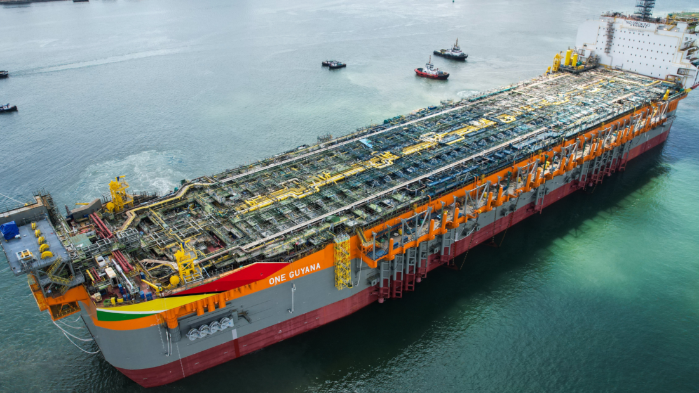
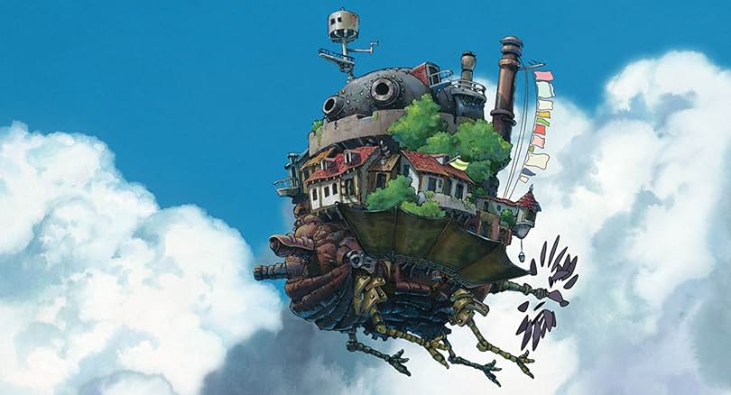
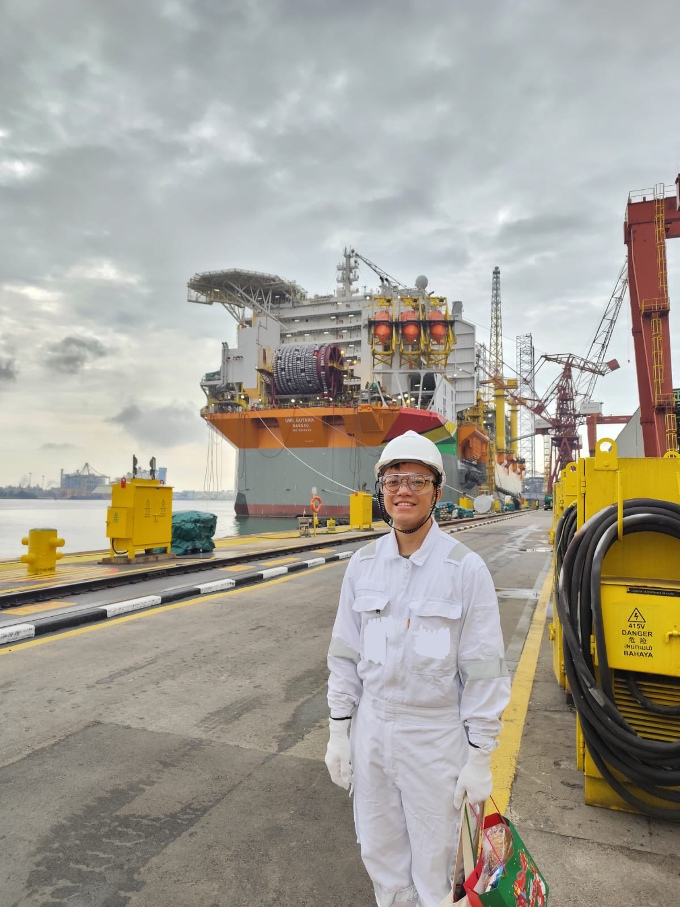

# My Wild Ride On A Floating Factory

Growing up in Singapore, I knew nothing about offshore oil and gas. My dad used to work in maritime industries, and I'd zone out every time he talked about shipping and charts. Little did I know I'd one day find myself on a massive floating vessel that's basically a city in the middle of the ocean.

The one I went on recently was the [FPSO One Guyana](https://www.sbmoffshore.com/newsroom/fpso-one-guyana-project-passes-another-major-milestone/), the largest of its kind globally. As you can see here, even the word 'massive' doesn't do it justice when you compare it's size to the smaller boats beside it.

<!-- more -->

!!! Disclaimer

    Given the classified nature of the operations happening on board the vessel, and how usually outsiders can’t enter, I am unable to share in detail what I saw, so the post centers mostly on my technical learnings & other casual observations.

## Wait, What's an FPSO?

First things first—FPSO stands for Floating Production Storage and Offloading. And no, it's not just a fancy oil tanker. Think of it more like a massive, self-contained factory that floats on the ocean.

Here's the basic process:

- Oil rigs drill the seabed
- The FPSO extracts oil and does some pretty complex magic
- It processes the oil, & manages different types of gas that accompanies the oil
- Water injection to maintain reservoir pressure (a key process to minimizing the ecological impact of offshore oil extraction!)

If I were placed on a random spot on the ship, I'd have a hard time orienting myself and figuring out how to get from one point to another.

## By the Numbers: The Floating Factory

This particular FPSO was mind-blowing:

- Produces 250,000 barrels of oil daily
- Generates about US$15 million in revenue per day
- Supports a 190-person crew
- Completely self-sufficient—generates its own power and water

Mostly though, as an anime fan, it reminded me of another large, floating castle... :P

## Day in the Life

**Picture this:** Engineers carrying on their shoulders different beams and poles, navigating a labyrinth of narrow passageways, their shoulders brushing against tangled electrical conduits while *squeezing* through congested corners, creeping through wire-strewn platforms.

Above, painters in heavy coveralls, *dangling* precariously to the ship's side, with safety harnesses cutting into their coveralls, brushstrokes against the ship’s hull with nothing but dark ocean waiting below.

Massive turbines that look like they were *ripped* out of commercial jets. Endless tubes, tanks, and storage units on every level. *Thick* coils of metallic rope used for anchoring the vessel. It was like walking through the most complex Lego set you could imagine. The intense, gritty atmosphere of the vessel hit me hard as I waded through the controlled chaos of mechanical complexity & human labor.

## The Tech Behind the Magic
I'm no marine engineer, but some (unclassified) stuff I saw included:

- Digital Twin systems to monitor everything in the production process
- Infrared & Audio sensors to detect different types of gas leaks
- The entire vessel was literally made to optimize the whole production process

The control room was like NASA mission control, but for oil production. Teams of operators made sure everything ran smoothly.

## More Than Just a Vessel

What struck me most wasn't the technology, but the scale. This floating factory is just one piece of a massive global system that powers our homes, our cities, our entire civilization.

Standing there, I felt small.  What gripped me then was the sense; that there are things much, much larger than myself, whose design I had no say in, whose form awes me, whose function is integral to our continued progress.

## The Unexpected Journey

I can't share all the details of how I ended up here, but it's been an opportunity I never expected. And honestly? I'm grateful for every mind-blowing moment.

